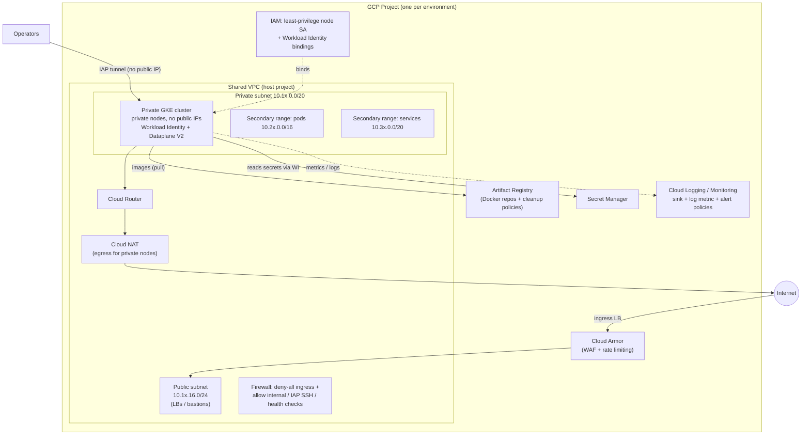
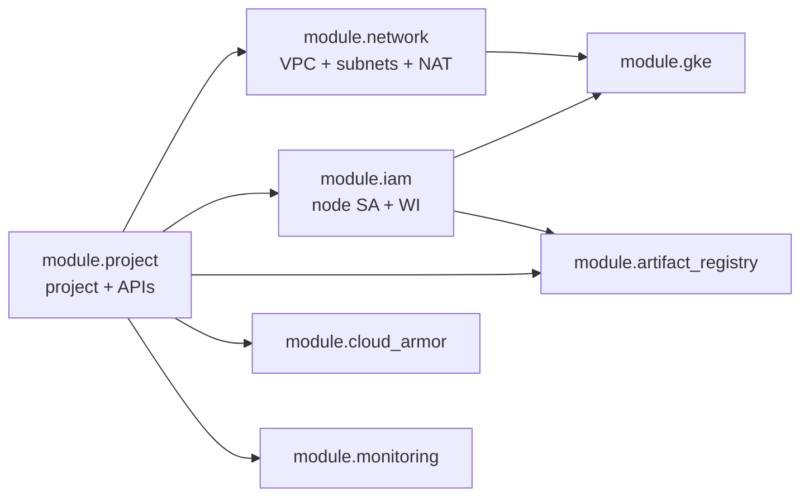

# Architecture

This repository implements a **GCP landing zone**: a consistent, secure,
repeatable foundation that every application project inherits, instead of
hand-built "snowflake" infrastructure that drifts per team.

The design has two axes:

1. **Reusable modules** (`modules/`) that encode *how* a capability is built
   (network, GKE, IAM, …) exactly once.
2. **Environment compositions** (`environments/{dev,staging,production}`) that
   decide *with what values* those modules are instantiated, and keep their
   Terraform state fully isolated from one another.

## Network topology (per environment)

Notes:

- **Private nodes, no public IPs.** Nodes reach Google APIs via Private Google
  Access and reach the internet only through **Cloud NAT** behind a **Cloud
  Router**. There is no default route to the internet from the nodes directly.
- **VPC-native cluster.** Pod and Service IPs come from **secondary ranges** on
  the private subnet, provisioned by the `network` module and referenced by the
  `gke` module by name.
- **Deny-by-default firewall.** An explicit deny-all-ingress rule at low
  priority makes the posture auditable; narrowly-scoped allow rules cover
  east-west traffic, IAP-tunneled SSH (`35.235.240.0/20`), and Google health
  checkers (`130.211.0.0/22`, `35.191.0.0/16`).

## Module composition pattern

Each environment's `main.tf` wires the modules together, passing outputs of one
as inputs to the next. Dependencies are expressed through references, so
Terraform computes the correct apply order automatically.

- `project` creates the project and enables required APIs; everything else
  targets `module.project.project_id`.
- `network` exposes subnet self-links and secondary-range names; `gke` consumes
  them so the two never disagree on names or CIDRs.
- `iam` produces the least-privilege node service account; both `gke` (node
  identity) and `artifact-registry` (pull permission) consume it.

## State isolation per environment

Every environment has its **own backend configuration** (`backend.tf`) pointing
at the **same GCS bucket** but a **different `prefix`**:

| Environment | Backend prefix                | Blast radius |
|-------------|-------------------------------|--------------|
| dev         | `environments/dev`            | disposable   |
| staging     | `environments/staging`        | pre-prod     |
| production  | `environments/production`     | isolated, own bucket recommended |

Because state is separated, a `terraform apply` in `dev` can never plan changes
to `staging` or `production`. Production is additionally recommended to live in
its **own bucket** (`acme-tfstate-platform-prod`) with tighter IAM, so that
read/write access to non-prod state grants nothing on prod.

## Environment sizing summary

| Aspect                  | dev                    | staging               | production                         |
|-------------------------|------------------------|-----------------------|------------------------------------|
| Node pool(s)            | 1× `e2-standard-2` spot | 1× `e2-standard-4`    | `e2-standard-8` + spot pool        |
| Autoscaling range       | 1–3                    | 2–5                   | 3–10 (+ 0–8 spot)                  |
| Node zones              | region default         | region default        | explicit 3-zone spread             |
| GKE release channel     | RAPID                  | REGULAR               | STABLE                             |
| Control-plane endpoint  | public (authorized)    | private               | private                            |
| Cloud Armor             | preview (log-only)     | enforced              | enforced + geo-block + adaptive    |
| Deletion protection     | off                    | on                    | on                                 |
| NAT min ports / VM      | 64                     | 128                   | 256 (+ full NAT logging)           |
