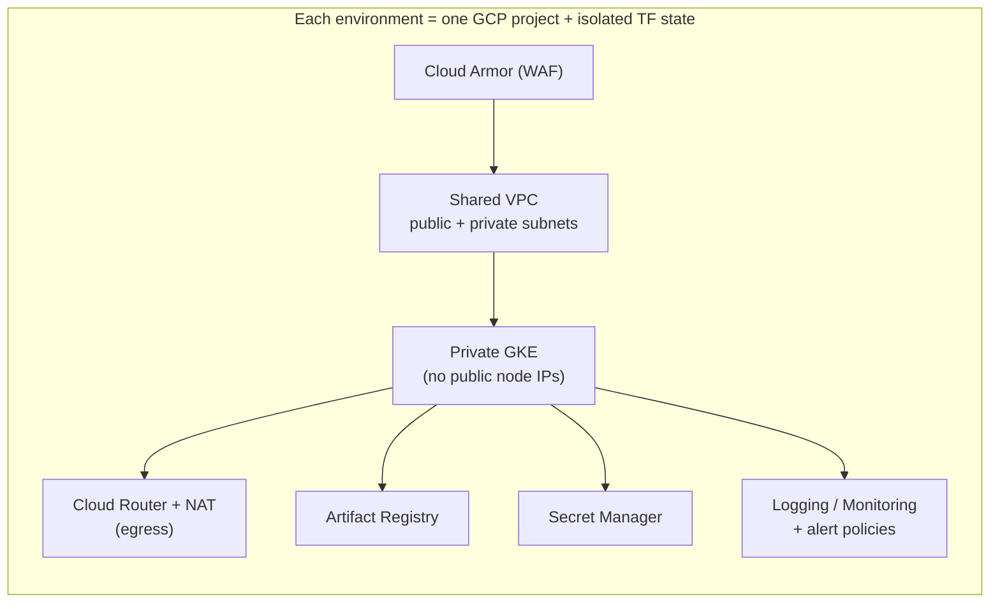

# Terraform GCP Landing Zone

A production-shaped, multi-environment **GCP platform foundation** built as
reusable Terraform modules composed per environment (dev / staging /
production). It provisions a Shared VPC with public/private subnets, Cloud
Router + Cloud NAT, a **private GKE cluster**, Artifact Registry, least-privilege
IAM with Workload Identity, Secret Manager, Cloud Logging/Monitoring alerting,
and Cloud Armor — with **remote, versioned, per-environment Terraform state**.

> Status: Infrastructure-as-Code reference implementation. All HCL is
> `terraform validate`-clean and `terraform fmt`-clean. No resources have been
> applied to a live account.

---

## 1. Business problem — why a landing zone?

Without a shared foundation, every team stands up its own project, VPC, IAM, and
cluster by hand. The result is **snowflake infrastructure**: inconsistent
network layouts, over-privileged service accounts, public clusters, no
guardrails, and state files scattered on laptops. Security and cost reviews
become archaeology.

A **landing zone** solves this by encoding the organization's opinionated,
secure defaults **once**, as reusable modules, and letting each environment
instantiate them with the right sizing. New environments are consistent by
construction, changes are reviewed as Terraform plans, and security controls
(private nodes, deny-by-default firewall, least-privilege IAM, WAF) are the
default rather than an afterthought.

## 2. Architecture

See [ARCHITECTURE.md](./ARCHITECTURE.md) for the full diagrams. In brief:



Reusable modules in `modules/` define *how* each capability is built; the
`environments/` directories decide *with what values* and keep their state
isolated. See the [environment sizing summary](./ARCHITECTURE.md#environment-sizing-summary).

## 3. Technology stack

| Layer                 | Technology                                              |
|-----------------------|---------------------------------------------------------|
| IaC                   | Terraform ≥ 1.5 (tested with 1.15.4)                    |
| Providers             | `hashicorp/google`, `hashicorp/google-beta` (5.30–6.x)  |
| Compute               | GKE (private, VPC-native, Dataplane V2, Workload Identity) |
| Networking            | Shared VPC, Cloud Router, Cloud NAT, VPC firewall       |
| Artifacts             | Artifact Registry (Docker) with cleanup policies        |
| Identity              | IAM custom roles, Workload Identity, IAM conditions      |
| Secrets               | Secret Manager                                          |
| Edge security         | Cloud Armor (OWASP WAF, rate limiting, geo, adaptive)   |
| Observability         | Cloud Logging sinks, log-based metrics, alert policies  |
| State                 | GCS backend, object versioning, per-env prefix          |
| Policy as code        | OPA/Conftest (Rego) + custom Checkov policies           |
| CI/CD                 | GitHub Actions + Workload Identity Federation (OIDC)     |

## 4. Repository structure

```
terraform-gcp-platform/
├── modules/                 # reusable building blocks (the "how")
│   ├── project/             # project + API enablement + labels/billing
│   ├── network/             # Shared VPC, subnets, secondary ranges, NAT, firewall
│   ├── gke/                 # private cluster + autoscaling node pools
│   ├── iam/                 # node SA, Workload Identity, custom role, IAM conditions
│   ├── artifact-registry/   # Docker repos + cleanup policies + scoped IAM
│   ├── cloud-armor/         # WAF, rate limiting, geo, preview/enforce
│   └── monitoring/          # log sink, log metric, alert policies
├── environments/            # compositions (the "with what") + isolated state
│   ├── dev/                 # small, cheap, disposable
│   ├── staging/             # prod dress rehearsal
│   └── production/          # HA, hardened, fully enforced
├── policies/                # OPA/Rego + Checkov custom policies
├── scripts/                 # bootstrap-state-bucket / validate / plan-all
├── .github/workflows/       # terraform-ci.yml
├── Makefile                 # fmt / validate / plan-* / apply-dev / lint / clean
├── ARCHITECTURE.md  SECURITY.md  CONTRIBUTING.md
```

The **module/environment split** is the core pattern: modules are versionable,
reviewable units with no environment-specific values baked in; environments are
thin compositions that supply values and isolate state.

## 5. Local setup

Prerequisites:

- Terraform ≥ 1.5 (`terraform version`)
- `gcloud` CLI authenticated: `gcloud auth login && gcloud auth application-default login`
- A GCP org/folder + billing account you can create projects under (for a real apply)

Offline validation (no GCP account needed):

```bash
make fmt validate          # fmt -check + init -backend=false + validate everywhere
# or the raw commands:
terraform fmt -check -recursive
terraform -chdir=environments/dev init -backend=false
terraform -chdir=environments/dev validate
```

To point at a real backend, first bootstrap the state bucket (section 6), then
uncomment the `backend "gcs"` block in `environments/<env>/backend.tf` and run
`terraform init` (without `-backend=false`).

## 6. Cloud deployment steps

Deploy environments **in order: dev → staging → production.**

```bash
# 0. One-time: create the versioned GCS state bucket
./scripts/bootstrap-state-bucket.sh acme-tfstate-platform europe-west1 <seed-project>

# 1. For each environment, copy and fill in the example vars
cp environments/dev/terraform.tfvars.example environments/dev/terraform.tfvars
$EDITOR environments/dev/terraform.tfvars      # project_id, billing_account, folder_id, ...

# 2. Uncomment the backend block in environments/dev/backend.tf, then:
terraform -chdir=environments/dev init
terraform -chdir=environments/dev plan        # review carefully
terraform -chdir=environments/dev apply        # only after the plan is approved

# 3. Repeat for staging, then production (production apply goes through CI, gated).
```

> ⚠️ Never run `terraform apply` for production locally. Production applies run
> through the gated CI job (section 7).

## 7. CI/CD flow

Defined in [`.github/workflows/terraform-ci.yml`](./.github/workflows/terraform-ci.yml):

| Trigger                | What runs                                                                 |
|------------------------|---------------------------------------------------------------------------|
| **Pull request**       | `fmt -check`, `validate` (all modules + envs), `tflint`, `tfsec`, `checkov` (with custom policies), and a **non-blocking `terraform plan` matrix** over dev/staging/production. The plan is the unit of review. |
| **Push to `main`**     | Static analysis only. **No apply happens on merge.**                       |
| **Manual dispatch**    | `apply` for a chosen environment, authenticated via **Workload Identity Federation** (no JSON keys). |
| **Production apply**   | Runs in a **protected GitHub Environment** that **requires reviewer approval** before the apply proceeds. |

## 8. Security controls

Full detail in [SECURITY.md](./SECURITY.md). Highlights:

- **Least-privilege IAM:** dedicated node SA (never the default compute SA),
  Workload Identity for pods, IAM conditions restricting Secret Manager access
  to a workload's own secrets.
- **Private GKE:** private nodes with no public IPs, private control plane in
  staging/production, shielded nodes, Dataplane V2 network policy.
- **Deny-by-default firewall** with scoped allow rules; operator access via IAP.
- **Cloud Armor:** OWASP WAF, rate-based ban, adaptive protection, optional
  geo-block — preview in dev, enforced in staging/production.
- **Secret Manager** for secrets — never in tfvars or committed state.
- **State protection:** remote, versioned, access-controlled GCS state;
  `.gitignore` blocks state and credential files.

## 9. Monitoring

The `monitoring` module provisions (per environment):

| Alert policy               | Signal                                                        | Why it matters |
|----------------------------|---------------------------------------------------------------|----------------|
| **GKE node CPU high**      | `kubernetes.io/node/cpu/allocatable_utilization` > threshold  | Saturated nodes → scheduling failures; prompts scaling or right-sizing. |
| **Pod restart storm**      | `kubernetes.io/container/restart_count` delta > threshold     | Detects crash loops early, before user-facing impact. |
| **Cloud NAT port exhaustion** | `router/nat/dropped_sent_packets_count` rate > 0            | Dropped egress packets are the tell-tale of NAT source-port exhaustion. |

Plus an **aggregated log sink** (exports selected logs to durable storage) and a
**log-based metric** counting container errors. Notification channels are
configurable; setting `alert_email` creates an email channel automatically.
Production uses tighter thresholds (node CPU 0.80, restarts > 3).

## 10. Failure / rollback process

- **Plan-before-apply discipline.** Nothing is applied without a reviewed plan.
  CI surfaces the plan on every PR; the manual apply re-plans before applying.
- **Versioned state rollback.** The state bucket has **object versioning** on.
  If a bad apply corrupts or advances state incorrectly, list prior generations
  and restore:
  ```bash
  gcloud storage ls -a gs://acme-tfstate-platform/environments/production/default.tfstate
  gcloud storage cp gs://.../default.tfstate#<GENERATION> gs://.../default.tfstate
  ```
  Then `terraform plan` to reconcile.
- **Revert a bad change.** Because infra is code, revert the offending commit,
  open a PR, review the resulting plan, and apply the revert through the normal
  gated flow.
- **Deletion protection** on staging/production clusters prevents an accidental
  `terraform destroy` from taking out a live cluster.
- **Targeted recovery.** For a single broken resource, `terraform apply
  -target=<addr>` can reconcile it without a full apply (use sparingly).

## 11. Cost considerations

- **Cloud NAT** is billed per gateway-hour **plus** data processed. dev keeps
  `min_ports_per_vm = 64`; production uses 256 with full logging (higher cost,
  needed for auditing high egress fan-out).
- **GKE node pools** are the dominant cost. dev runs a **single spot**
  `e2-standard-2` (1–3 nodes) to stay cheap and disposable; production runs an
  on-demand `e2-standard-8` pool (3–10) **plus** a spot pool (0–8) for
  interruptible workloads, so steady-state capacity is on-demand and burst is
  cheap.
- **Cloud Armor** is billed per policy + per rule + per request. dev runs it in
  **preview** (still billed, but validates rules cheaply at low traffic);
  enforcement scales with production traffic.
- **Artifact Registry** storage is controlled by **cleanup policies** (dev keeps
  10 versions / 14 days untagged; production keeps 50 / 60 days, immutable).
- dev is intentionally cheaper on every axis: spot nodes, smaller machines,
  fewer NAT ports, shorter artifact retention, Cloud Armor in preview.

## 12. Example `terraform plan` output

The snippet below is **real output** from running:

```bash
terraform -chdir=environments/dev plan -input=false \
  -var 'project_id=acme-platform-dev' -var 'project_name=ACME Platform dev' \
  -var 'folder_id=123456789012' -var 'billing_account=AAAAAA-BBBBBB-CCCCCC' \
  -var 'region=europe-west1'
```

No resources were applied. Because the configuration contains **no data
sources** and every resource is new, Terraform renders the full create plan
locally without contacting GCP — so this plan is reproducible offline. (A plan
against a *real* backend with existing state would additionally require GCP
credentials.)

```text
Terraform will perform the following actions:

  # module.gke.google_container_cluster.this will be created
  + resource "google_container_cluster" "this" {
      + datapath_provider                        = "ADVANCED_DATAPATH"
      + deletion_protection                      = false
      + enable_shielded_nodes                    = true
      + initial_node_count                       = 1
      + location                                 = "europe-west1"
      + name                                     = "acme-dev-gke"
      + networking_mode                          = "VPC_NATIVE"
      + remove_default_node_pool                 = true
      + resource_labels                          = {
          + "cost_center" = "engineering"
          + "env"         = "dev"
          + "managed_by"  = "terraform"
          + "team"        = "platform"
        }
      + private_cluster_config {
          + enable_private_endpoint = false
          + enable_private_nodes    = true
          + master_ipv4_cidr_block  = "172.16.0.0/28"
        }
      + workload_identity_config {
          + workload_pool = "acme-platform-dev.svc.id.goog"
        }
      # ... (ip_allocation_policy, release_channel, logging/monitoring, etc.)
    }

  # module.network.google_compute_router_nat.this will be created
  # module.network.google_compute_subnetwork.this["acme-dev-private-europe-west1"] will be created
  # module.iam.google_service_account.gke_node will be created
  # ... (38 more)

Plan: 41 to add, 0 to change, 0 to destroy.
```

---

## Repository conventions & validation

```bash
make fmt        # terraform fmt -recursive
make validate   # init -backend=false + validate for all modules + envs
make lint       # tflint / tfsec / checkov if installed (scripts/validate.sh)
make plan ENV=staging
```

See [CONTRIBUTING.md](./CONTRIBUTING.md) for module conventions, how to add an
environment, and the PR/plan review process.

## License

[MIT](./LICENSE)
